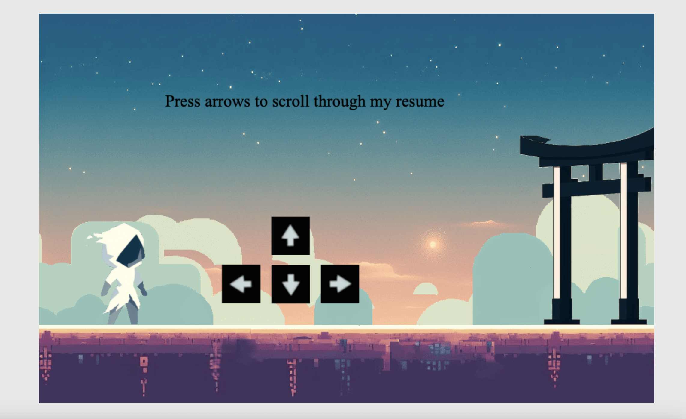

# 🎮 Playable Portfolio

Interactive resume in the form of a 2D game.

**[Play it here](https://aladin20c.github.io/portfolio-playable/)**

## About

Explore the world, interact with objects, and discover my work in a fun, engaging way (keep sound on).

## Features

- 2D exploration with arrow keys / touch controls
- Interactive objects
- Parallex background

## Tech

- Vanilla JavaScript + Canvas
- Custom simple game engine and collision detection
- HTML5, CSS3
- Hosted on GitHub Pages